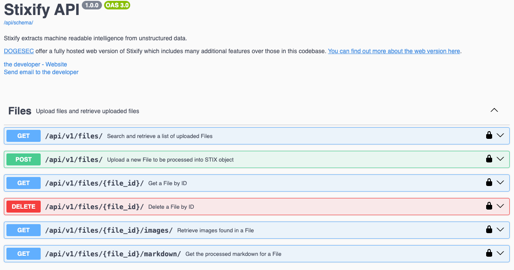

# Stixify

[](https://codecov.io/gh/muchdogesec/stixify)

## Before you begin...

We offer a fully hosted web version of Stixify which includes many additional features over those in this codebase. [You can find out more about the web version here](https://www.stixify.com/).

## Overview



Stixify takes a file and converts into structured threat intelligence.

Lots of intelligence is shared in PDFs, Word docs, Powerpoints, emails, Slack messages, etc.

To help automate the extraction of intelligence from these documents, Stixify automatically extracts indicators for viewing to a user.

It works at a high level like so:

1. A file is added to Stixify (selecting profile to be used)
2. The file is converted into markdown by file2txt
3. The markdown is run through txt2stix where txt2stix pattern extractions/whitelists/aliases are run based on staff defined profile
4. STIX bundles are generated for the file, and stored in a database called `stixify` and a collection matching the `identity` ID used to create the objects
5. A user can access the bundle data or specific objects in the bundle via the API

## tl;dr

[](https://www.youtube.com/watch?v=etK5NhrsHtU)

[Watch the demo](https://www.youtube.com/watch?v=etK5NhrsHtU).

## Install

### Download and configure

```shell
# clone the latest code
git clone https://github.com/muchdogesec/stixify
```

### Configuration options

Stixify has various settings that are defined in an `.env` file.

To create a template for the file:

```shell
cp .env.example .env
```

To see more information about how to set the variables, and what they do, read the `.env.markdown` file.

### Build the Docker Image

```shell
sudo docker compose build
```

### Start the server

```shell
sudo docker compose up
```

### Access the server

The webserver (Django) should now be running on: http://127.0.0.1:8004/

You can access the Swagger UI for the API in a browser at: http://127.0.0.1:8004/api/schema/swagger-ui/

## Contributing notes

Stixify is made up of different core external components that support most of its functionality.

At a high-level the Stixify pipeline looks like this: https://miro.com/app/board/uXjVKxw0HPw=/

Generally if you want to improve how Stixify performs functionality, you should address the changes in;

* [file2txt](https://github.com/muchdogesec/file2txt/): converts the file into a markdown file (which is used to extract data from)
* [txt2stix](https://github.com/muchdogesec/txt2stix): turns the markdown file into STIX objects
* [stix2arango](https://github.com/muchdogesec/stix2arango): manages the logic to insert the STIX objects into the database

For anything else, then the Obstracts codebase is where you need to be :)

## Support

[Minimal support provided via the DOGESEC community](https://community.dogesec.com/).

## License

[Apache 2.0](/LICENSE).